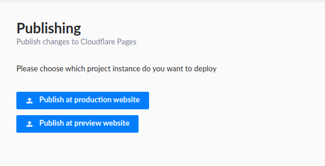

# Strapi plugin cloudflare-pages

[![NPM version][npm-image]][npm-url]
[![PR Welcome][npm-downloads-image]][npm-downloads-url]

This is a plugin for [Strapi](https://github.com/strapi/strapi) headless CMS. It lets you easily trigger Cloudflare Pages builds from Strapi.

**The main branch is compatible with Strapi v4. If you are looking for the version compatible with Strapi v3 please switch to the [v3 branch](https://github.com/sarhugo/strapi-plugin-cloudflare-pages/tree/v3).**

## Introduction



When using Strapi as a headless CMS for a statically built website you need a way to trigger the site to rebuild when content has been updated. The typical approach is to setup a Strapi managed webhook to trigger a build whenever content changes. This approach has it's issues. For example when making many changes to content, builds are triggered multiple times and deployments can fail due to the site being deployed concurrently. Also you don't have a way to filter entity types for webhooks, so in case you handle a contact form via content creation you will be triggering a new build every time a new message is received.

This plugin tackles the publishing flow a different way. The site administrators can take their time and make many changes and once the content update is complete they can trigger a single build.

You can configure several instances in order to manage preview builds, not just production one.

This plugin takes the approach from the one implemented to trigger builds at github CI/CD, available [here](https://github.com/phantomstudios/strapi-plugin-github-publish).

## Installation

Install this plugin with npm or yarn.

With npm:

```bash
npm install strapi-plugin-cloudflare-pages
```

With yarn:

```bash
yarn add strapi-plugin-cloudflare-pages
```

## Configuration

Generate a config file at `config/plugins.js` or `config/development/plugins.js` etc...

```javascript
module.exports = ({ env }) => ({
  'cloudflare-pages': {
    enabled: true,
    config: {
      instances: [
        {
          name: "production website",
          hook_url: 'https://...'
        },
        {
          name: "preview website",
          hook_url: 'https://...'
        },
      ]
    }
  }
});
```

## Use the Plugin

When the plugin has been installed correctly just click on `Cloudflare Pages Publishing` in the sidebar under plugins.

[npm-image]: https://img.shields.io/npm/v/strapi-plugin-cloudflare-pages.svg?style=flat-square&logo=react
[npm-url]: https://npmjs.org/package/strapi-plugin-cloudflare-pages
[npm-downloads-image]: https://img.shields.io/npm/dm/strapi-plugin-cloudflare-pages.svg
[npm-downloads-url]: https://npmcharts.com/compare/strapi-plugin-cloudflare-pages?minimal=true